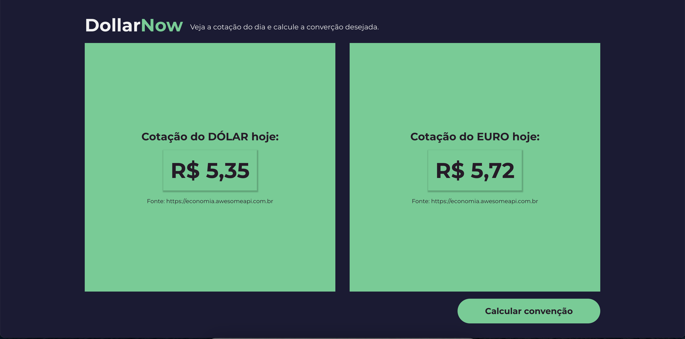
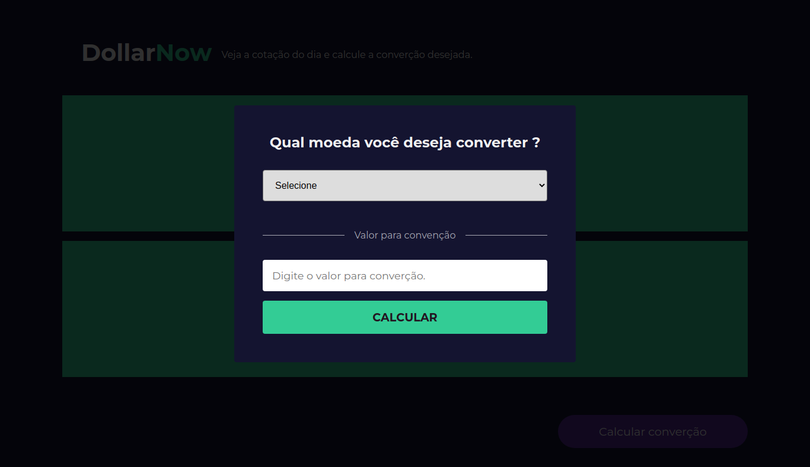

<h1 align="center">Dollar and Euro Cotation</h1>

<p align="center">
  <a href="#dart-about">About</a> &#xa0; | &#xa0;
  <a href="#rocket-technologies">Technologies</a> &#xa0; | &#xa0;
  <a href="#white_check_mark-requirements">Requirements</a> &#xa0; | &#xa0;
  <a href="#checkered_flag-starting">Starting</a> &#xa0; | &#xa0;
  <a href="#memo-license">License</a> &#xa0; | &#xa0;
  <a href="https://github.com/davi1985" target="_blank">Author</a>
</p>

<br>

## :dart: About

Live Dollar and Euro quotation;

## Screenshots



<br/>



## :rocket: Technologies

The following tools were used in this project:

- [React](https://pt-br.reactjs.org/)
- [TypeScript](https://www.typescriptlang.org/)
- [Styled Componets](https://www.typescriptlang.org/)
- [Vite](https://www.typescriptlang.org/)
- [Axios](https://www.typescriptlang.org/)

## :white_check_mark: Requirements

Before starting :checkered_flag:, you need to have [Git](https://git-scm.com) and [Node](https://nodejs.org/en/) installed.

## :checkered_flag: Starting

```bash
# Clone this project
$ git clone https://github.com/davi1985/dollar-now-quotation

# Access
$ cd dollar-now-quotation

# Install dependencies
$ yarn

# Run the project
$ yarn start

# The server will initialize in the <http://localhost:3000>
```

Made with :heart: by <a href="https://github.com/davi1985" target="_blank">Davi Silva</a>

&#xa0;

<a href="#top">Back to top</a>
